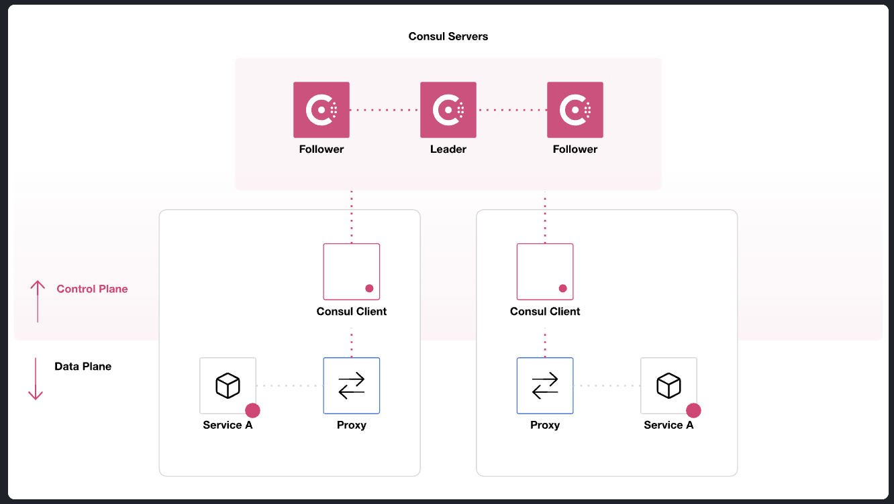

# Consul Architecture

Consul architecture is better described on this document [Consul Architecture](https://developer.hashicorp.com/consul/docs/architecture).

Also, note there's a [Reference architecture tutorial](https://developer.hashicorp.com/consul/tutorials/production-deploy/reference-architecture) that we should keep in mind.

## Summary

Here's an example of Consul architecture:

  

- **Purpose:**

- Consul provide a control plane that maintains a central registry to track services and their IP addresses.
- Using the service mesh, Consul dynamically configure sidecar and gateway proxies to route traffic between services. More info about proxies in Consul can be found at [Service mesh proxies](https://developer.hashicorp.com/consul/docs/connect/proxies)

  - A _*Sidecar proxy*_ handle inbound/outbound traffic as well as wrap and verify TLS connections. This, in a non-containered network should be one per service.
  - A _*Gateway proxy*_ is a mesh network proxy that allows traffic service-to-service accross different areas (peered clusters, federated WAN datacenters, nodes outside the mesh )

- **Components:**
  - **Consul Datacenters:** is part of the Consul control plane. Each control plane can have one or more datacenters.
    - The datacenter is the unit of deployment and replication in Consul.
    - Each datacenter has at least one Consul server agent and one or more Consul client agents.
  - **Consul cluster:** is "A collection of Consul agents that are aware of each other". The terms cluster and datacenter are often used interchangeably.
    - This can vary depending on the situation, as in some cases the term is used for a collection of server agents, while in others it refers to a collection of client agents.
  - **Agents:** are daemons that implement Consul control plane functionality. They can be either server or client side.
    - **Server agents:** store all state information including service and node IP addresses
      - 3 to 5 server agents are recommended for a datacenter
      - Too many servers can slow down consensus.
        - Consul elect a server to be the leader of the consensus protocol.
        - That leader processes all queries and transactions.
        - Non-leader servers are called follower and they forward queries from clients to the leader.
        - The leader replicate requests to the followers.
        - If the leader fails, a new leader is elected.
        - Consensus is achieved using the Raft protocol. That runs on port 8300.
    - **Client agents:**
      - Client agensts report node and service health to the server agents.
      - Should be run on every compute node.
      - Use RPC over port 8300 to communicate with server agents.
      - Recommend to run a maximum of 5000 client agents per datacenter.
      - Additional Datacenters can be added to the cluster.
    - **Lan Gossip pool:**
      - distribute and perform node helth checks
      - Consist on both server and client agents
      - Run on port 8301 UDP with TCP fallback if UDP is not available.
    - **Cross datacenter requests:**
      - By default information is not shared between datacenters.
      - Information can be shared using WAN federation and/or cluster peering.
      - **Wan federation:**
        - connect multiple datacenters.
        - a primary datacenter is required to connect the multiple datacenters.
        - the primary datacenter has authoritative information about the other datacenters.
        - If a remote client agent requests some resource from a remote datacenter, a local server will forward the request, via RPC, to another remote server that has access to the resource.
        - Wan federated runs on port TCP 8300
        - **Wan Gossip:**
          - optimised for WAN communication with high latency.
          - enable information sharing between datacenters.
          - run on port TCP/UDP 8302.
        - **Cluster peering:**
          - Connect independent clusters using peering.
          - can also make admin partitions (these partitions allow us to have isolated network regions within the same Consul servers) communicate with each other.
          - That communication is done via tokens.
